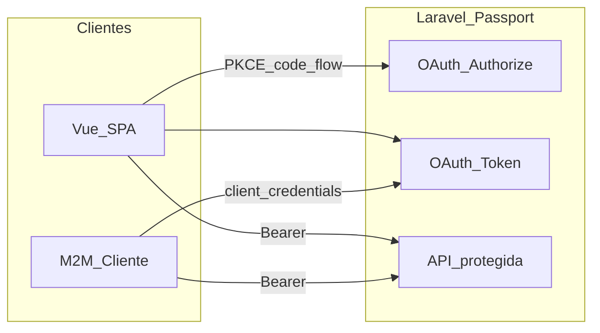

# Especificação: OAuth2 com Laravel Passport

Documento de especificação para implementar **OAuth 2.0** no backend **[src/](../src/)** do repositório **hire-wire**, usando **Laravel Passport** como *authorization server* (emissão e validação de tokens de acesso para a API). Alinha-se ao [README](../README.md) do projeto e à infraestrutura descrita em [infra.md](infra.md).

---

## 1. Objetivo

- Expor a API REST sob prefixo **`/api`** protegida por **Bearer tokens** OAuth2 emitidos pelo próprio Laravel.
- Permitir que o frontend **Vue.js** (primeira parte) obtenha tokens sem embutir *client secret* no navegador, via **Authorization Code com PKCE**.
- Permitir integrações **máquina-a-máquina** (opcional no escopo inicial) via **Client Credentials**, com cliente confidencial.

### 1.1 Fora deste escopo

- **Login social** (“Entrar com Google/GitHub”): isso é cliente OAuth em terceiros; em Laravel costuma ser **Laravel Socialite**, não Passport. Não faz parte desta especificação.
- Substituir Passport por **Sanctum** para o mesmo produto: decisão arquitetural distinta; aqui assume-se **Passport** por alinhamento ao README do projeto.

---

## 2. Estado atual e lacunas

| Item | Estado esperado pela documentação | Estado atual (verificar no repositório) |
|------|-----------------------------------|----------------------------------------|
| Pacote Passport | Presente | `composer.json` sem `laravel/passport` até a implementação |
| Migrações OAuth | Aplicadas | Depende de publicação e `migrate` |
| Guard `api` | `driver: passport` | `config/auth.php` típico só com `web` |
| Rotas API | Arquivo dedicado + prefixo `/api` | `bootstrap/app.php` pode registrar só `web` e `console` |
| Model `User` | `HasApiTokens` + `OAuthenticatable` | Model padrão sem trait/interface Passport |

Esta especificação descreve o **estado-alvo** após a implementação.

---

## 3. Requisitos funcionais

1. **RF-01** — Um usuário autenticável (`users`) pode autorizar um cliente OAuth (SPA ou confidencial) e receber **access token** (e **refresh token** quando aplicável ao fluxo).
2. **RF-02** — Endpoints de negócio da API exigem um access token válido e, quando definidos, **escopos** adequados.
3. **RF-03** — Tokens revogados ou expirados não autorizam acesso à API.
4. **RF-04** — O fluxo recomendado para o SPA Vue é **Authorization Code + PKCE** (cliente público, sem secret no frontend).
5. **RF-05** — Telas de **consentimento/autorização** OAuth existem e são renderizadas pelo Laravel (Passport 13 é *headless*: views customizadas obrigatórias).

---

## 4. Requisitos não funcionais

1. **RNF-01** — Compatibilidade: **PHP 8.3**, **Laravel 13** (conforme `src/composer.json`), **Passport 13.x** (série alinhada à documentação oficial do ecossistema Laravel 11+).
2. **RNF-02** — Comandos Artisan de instalação e migração executados no container **`app`** do Docker Compose, quando o desenvolvimento for via [infra.md](infra.md).
3. **RNF-03** — Segredos de cliente confidencial **não** versionados; apenas exemplo no `.env.example` sem valores reais.
4. **RNF-04** — *Password grant* permanece **desabilitado** por padrão (política de segurança); habilitar só se houver requisito explícito e análise de risco documentada.
5. **RNF-05** — Testes automatizados cobrem pelo menos um endpoint `auth:api` com sucesso e falha (token ausente/inválido).

---

## 5. Arquitetura lógica

- **OAuth Authorize / Token**: rotas fornecidas pelo Passport (conforme versão instalada e documentação oficial).
- **API protegida**: rotas em `routes/api.php` (ou equivalente) com middleware `auth:api` e, se necessário, verificação de escopos.

---

## 6. Fluxo SPA: Authorization Code + PKCE (normativo)

Ordem lógica:

1. O SPA gera **verifier** e **challenge** (PKCE) e redireciona o utilizador para o endpoint de autorização do Passport com `client_id`, `redirect_uri`, `response_type=code`, `code_challenge`, `code_challenge_method=S256`, e escopos solicitados.
2. O utilizador autentica-se (sessão `web` ou fluxo já existente no app) e aprova na view de autorização OAuth.
3. O Passport redireciona de volta ao SPA com `code`.
4. O SPA troca o `code` pelo token via **POST** ao endpoint de token (sem enviar *client secret* se o cliente for público), incluindo o `code_verifier`.
5. Chamadas à API incluem `Authorization: Bearer {access_token}`.

Detalhes de parâmetros e URLs devem seguir a **documentação atual do Laravel Passport** para a versão fixada no `composer.lock`.

---

## 7. Configuração e artefatos no repositório

### 7.1 Dependências

- Adicionar `laravel/passport` na versão compatível com Laravel 13 (série **13.x** do Passport, salvo indicação contrária da documentação oficial no momento do `composer require`).

### 7.2 Migrações

- Publicar migrações Passport: `php artisan vendor:publish --tag=passport-migrations`.
- Executar `php artisan migrate`.
- Executar o fluxo de geração de chaves / clientes inicial descrito na documentação da versão (comando tipo `passport:install` ou sucessor documentado).

### 7.3 Modelo de utilizador

O model `App\Models\User` deve:

- Continuar a estender `Illuminate\Foundation\Auth\User\Authenticatable` (ou equivalente do projeto).
- Utilizar `Laravel\Passport\HasApiTokens`.
- Implementar `Laravel\Passport\Contracts\OAuthenticatable`.

(Requisito explícito a partir do Passport 13.)

### 7.4 Autenticação (`config/auth.php`)

- Definir guard `api` com `driver` `passport` e provider `users` (ou o provider oficialmente usado pelo projeto).
- Manter guard `web` para sessão e para páginas de autorização OAuth no browser.

### 7.5 Bootstrap do Passport (`AppServiceProvider`)

No método `boot()` do `App\Providers\AppServiceProvider` (ou provider dedicado, se o time padronizar):

- Configurar expiração de access/refresh tokens conforme política do produto.
- Registrar views ou prefixo de views Passport 13 (*headless*), por exemplo:
  - `Passport::authorizationView(...)` / `Passport::viewPrefix(...)` e views Blade correspondentes em `resources/views/...`.
- Definir mapa de escopos via `Passport::tokensCan([...])` (nomes estáveis, versionáveis).
- **Não** habilitar *password grant* salvo decisão documentada em ADR ou anexo de segurança.
- Opcional: `Passport::$registersJsonApiRoutes` somente se for inevitável manter API JSON legada de gestão; preferir não depender disso para o desenho novo.

Comportamentos padrão do Passport 13 a respeitar na documentação interna:

- Identificadores de cliente em **UUID** por padrão.
- *Client secrets* armazenados de forma **hash** (irreversível após gravação).

### 7.6 Rotas

- Registrar ficheiro **`routes/api.php`** em `bootstrap/app.php` com prefixo **`/api`** e middleware de API do Laravel aplicável.
- Agrupar rotas protegidas com `middleware(['auth:api'])`.
- Aplicar middleware de escopo Passport 13 onde necessário (classes renomeadas na série 13; usar nomes da documentação vigente, por exemplo verificação de *scopes*).

### 7.7 Variáveis de ambiente (`src/.env.example`)

Documentar sem segredos reais, por exemplo:

- `APP_URL` (base correta para `redirect_uri` e absolutização de URLs OAuth).
- Opcional: variáveis específicas se o time padronizar IDs de cliente de desenvolvimento (nunca commitar `.env` com secrets).

### 7.8 Permissões de chaves OAuth

- Em ambientes Linux no container, seguir orientação da documentação Passport para permissões de `oauth-private.key` / `oauth-public.key`.
- Em desenvolvimento Windows nativo, tratar exceções de validação de permissão conforme UPGRADE do Passport (ex.: flag de validação só em dev, se inevitável).

---

## 8. Escopos (proposta inicial)

Ajustar nomes aos domínios reais do hire-wire (contas, utilizadores, etc.):

| Escopo | Uso |
|--------|-----|
| `read:accounts` | Leitura de saldos e dados de contas do utilizador |
| `write:accounts` | Operações de escrita (ex.: depósitos) |
| `read:profile` | Leitura de perfil básico do utilizador |

Regra: controllers ou camada de aplicação **não** fazem autorização por escopo espalhada; usa-se middleware de token/escopos do Passport + eventual policy por recurso.

---

## 9. Clientes OAuth a criar

| Cliente | Tipo | Fluxo | Notas |
|---------|------|-------|-------|
| SPA local | Público | Authorization Code + PKCE | `redirect_uri` do dev server Vue; sem secret |
| Integração M2M (fase posterior) | Confidencial | Client Credentials | Secret só no servidor consumidor |

---

## 10. Frontend (Vue)

- Implementar helper de OAuth PKCE (geração de verifier/challenge, armazenamento temporário seguro do verifier até à troca do code).
- Definir **onde** persistir access token (preferência por estratégia acordada com o time: memória + refresh, ou BFF; evitar padrões inseguros).
- Tratar `401`/`403` com refresh token quando o fluxo o suportar, ou re-login via authorize.

---

## 11. Testes

- **Teste de sucesso:** utilizador com token válido (via `Passport::actingAs` ou cliente de teste conforme docs) acede a rota `GET` protegida.
- **Teste de falha:** sem header `Authorization` ou com token inválido → `401`.
- **Teste de escopo (se aplicável):** token sem escopo exigido → `403` (comportamento esperado conforme middleware configurado).

---

## 12. Critérios de aceitação

1. `composer show laravel/passport` confirma versão instalada compatível.
2. Migrações OAuth aplicadas sem erro em ambiente Docker descrito em [infra.md](infra.md).
3. Pedido à API protegida sem token retorna não autorizado.
4. Fluxo manual ou teste automatizado demonstra emissão de token e acesso autorizado.
5. View de autorização OAuth renderiza e permite aprovar/recusar sem erro 500.
6. `.env.example` atualizado com comentários sobre URLs e variáveis relevantes (sem secrets).

---

## 13. Referências

- Documentação Laravel: [Passport](https://laravel.com/docs/12.x/passport) (ajustar a versão major da documentação ao Laravel em uso no momento da implementação).
- Repositório: [laravel/passport](https://github.com/laravel/passport) — ficheiro `UPGRADE.md` da série instalada (ex.: 13.x) para breaking changes (headless, `OAuthenticatable`, middlewares, password grant desativado, etc.).
- Padrões de código do projeto: [docs/paterns/php-laravel.patern.md](paterns/php-laravel.patern.md).

---

## 14. Changelog deste documento

| Data | Alteração |
|------|-----------|
| 2026-04-06 | Versão inicial da especificação OAuth2 / Laravel Passport para hire-wire |
