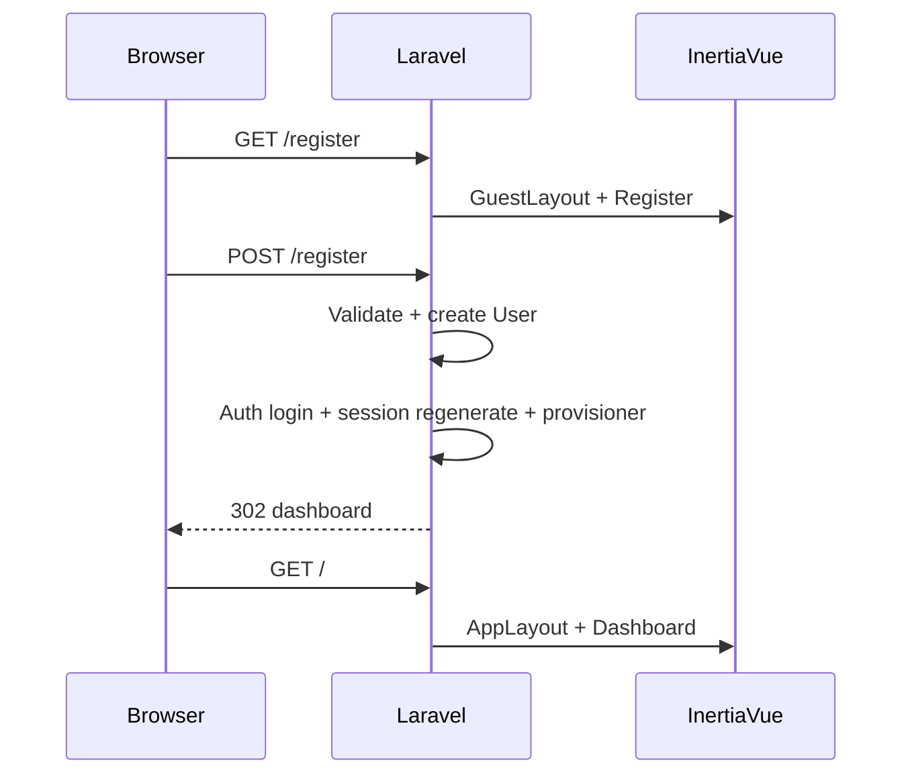
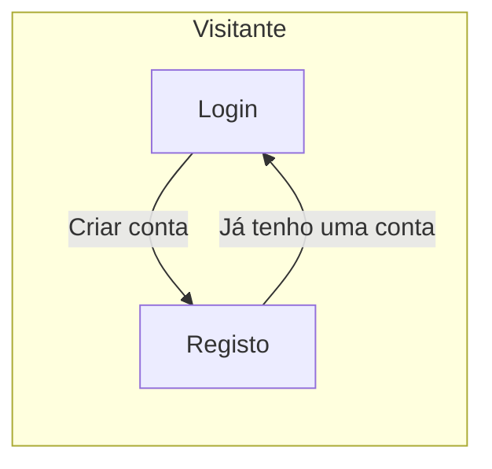

# Especificação: Cadastro inicial do cliente (nova conta)

Documento normativo para implementar o **registo self-service** de clientes na **Fase 5** (complemento a [spec_fase5_web_auth_dashboard.md](spec_fase5_web_auth_dashboard.md)): formulário **criar conta**, rotas e validação, ligações de navegação com o **login**, e testes.

**Código-alvo:** backend e front-end em **[src/](../src/)**. Padrões de UI: [paterns/front-end_vue3.md](paterns/front-end_vue3.md).

---

## 1. Objetivo

- Permitir que um **visitante** crie a **primeira conta** na aplicação (cadastro do cliente), com dados mínimos alinhados ao modelo `App\Models\User` e às regras de domínio existentes.
- Após o registo bem-sucedido, o cliente deve poder **aceder ao dashboard** de forma coerente com o fluxo de login (sessão web + regeneração de sessão).
- Garantir **descoberta clara** entre as duas entradas:
  - Na página **Criar conta**: link **«Já tenho uma conta»** → rota nomeada de login (`login`).
  - Na página **Entrar** (login): link **«Criar conta»** (ou copy equivalente, ex. «Ainda não tem conta?») → rota nomeada de registo (`register`).

---

## 2. Fora do escopo (esta iteração)

- **Verificação de e-mail** obrigatória antes de usar a app (`MustVerifyEmail`) — pode ser fase posterior; se já existir coluna `email_verified_at`, pode permanecer `null` até política de produto definida.
- **Convites** ou registo apenas por administrador.
- **Login social** — ver secção «Fora do escopo» na especificação da Fase 5.

---

## 3. Requisitos funcionais

| ID | Descrição |
|----|-----------|
| **NU-01** | Visitante acede a `GET /register` (ou URI acordada) com middleware **`guest`**; utilizador já autenticado é **redirecionado** para o dashboard (ou `intended`), igual ao comportamento típico de `/login`. |
| **NU-02** | Formulário **Criar conta** (Inertia + Vue 3, `GuestLayout`) envia **`POST /register`** com proteção **CSRF**; campos mínimos: **nome**, **CPF**, **e-mail**, **senha**, **confirmação de senha** (alinhado a `fillable` do `User`: `name`, `cpf`, `email`, `password`). |
| **NU-03** | **Validação servidor:** `email` único (`users.email`); `cpf` único (`users.cpf`) e **válido** segundo o valor de domínio existente ([`App\Domain\Users\ValueObjects\Cpf`](../src/app/Domain/Users/ValueObjects/Cpf.php)) — normalizar entrada (remover pontuação) antes de persistir **apenas dígitos** (11 caracteres), consistente com o repositório/factories do projeto. |
| **NU-04** | **Senha:** `confirmed` (campo `password_confirmation`); regra mínima acordada com o projeto (ex. `min:8` ou política Laravel `Password::defaults()` se já adoptada). Palavra-passe persistida com **hash** (o cast `hashed` do `User` já cobre a atribuição). |
| **NU-05** | **Transação:** criação do registo em `users` de forma **atómica**; em falha de validação, devolver erros por campo à página Inertia (422). |
| **NU-06** | **Pós-registo:** após criar o utilizador, efectuar **`Auth::login($user)`** (ou `loginUsingId`), **`$request->session()->regenerate()`**, invocar o mesmo [**`LocalUserProfileProvisioner`**](../src/app/Services/Auth/LocalUserProfileProvisioner.php) usado no login para manter **perfil/nome/cpf** coerentes, e **redirecionar** para `route('dashboard')` (ou `intended` se aplicável). |
| **NU-07** | **Throttle** em `POST /register` (ex. `throttle:5,1` por IP, alinhado a `POST /login`) para mitigar abuso. |
| **NU-08** | **Navegação:** na página de registo, elemento claramente identificável **«Já tenho uma conta»** com link para `route('login')` (Inertia `<Link>` ou `href` gerado pelo Ziggy se em uso). Na página de login, link para **`route('register')`** com texto orientado a **criar conta** (ex. «Criar conta» ou «Ainda não tem conta? Criar conta»). |
| **NU-09** | Mensagens de erro **amigáveis** em PT onde o produto já usa PT na UI; mensagens genéricas de unicidade (`email`, `cpf`) sem vazar existência de conta além do necessário (pode manter mensagens Laravel padrão ou uniformizar com login). |

---

## 4. Requisitos não funcionais

| ID | Descrição |
|----|-----------|
| **NUN-01** | Mesma stack da Fase 5: Inertia, Vue 3, `<script setup>`, `useForm`, Tailwind, sem expandir estado global desnecessariamente. |
| **NUN-02** | Controller dedicado (ex. `RegisteredUserController` ou `RegisterController`) em `App\Http\Controllers\Auth`, ou camada equivalente já adoptada no projeto — evitar lógica de negócio pesada na closure de rota. |
| **NUN-03** | Testes de feature executáveis com `php artisan test`. |

---

## 5. Contrato de rotas (sugestão)

| Método | URI | Middleware | Comportamento |
|--------|-----|------------|---------------|
| `GET` | `/register` | `guest` | Inertia: `Auth/Register` (ou nome de página alinhado a `Pages/Auth/`). |
| `POST` | `/register` | `guest`, throttle | Validar; criar `User`; login + regenerate + provisioner; redirect dashboard. |

- Nomes de rota sugeridos: `register`, `register.store` (ou `register` apenas para POST se preferir convenção única — documentar no `web.php`).

**Redirect de visitante autenticado:** o middleware `guest` do Laravel já redireciona tipicamente para `/` — garantir que isso coincide com o dashboard nomeado.

---

## 6. Camada front-end

### 6.1 Página `Register` (Vue)

- Layout: **`GuestLayout`**, consistência visual com [Login.vue](../src/resources/js/Pages/Auth/Login.vue) (títulos, cartão do formulário, espaçamento).
- Campos com `autocomplete` apropriados: `name`, `email`, `new-password` (senha e confirmação).
- CPF: máscara **opcional** no cliente; validação definitiva no servidor.
- Rodapé do bloco: link **«Já tenho uma conta»** → login.

### 6.2 Página `Login` (alteração)

- Abaixo do formulário ou junto ao título: link **«Criar conta»** → `register`.

---

## 7. Segurança

1. **CSRF** em todos os POST.
2. **Sessão:** `session()->regenerate()` após login automático no registo (mitigar fixation).
3. **Password:** nunca expor hash; não logar pedidos com senha em claro.
4. **Enumeração:** aceitar trade-off das mensagens de validação `unique` (padrão Laravel); se no futuro for exigido anti-enumeração, especificar mensagem única genérica noutro documento.

---

## 8. Testes (obrigatórios)

| # | Caso |
|---|------|
| 1 | `GET /register` com **guest** retorna 200 e página/componente esperado (assert Inertia ou conteúdo estável). |
| 2 | `POST /register` com dados **válidos** cria utilizador, utilizador fica **autenticado** (sessão), redireciona para dashboard (ou 302 para `/`). |
| 3 | `POST /register` com **e-mail duplicado** falha validação (422) e **não** cria segundo utilizador. |
| 4 | `POST /register` com **CPF duplicado** ou **CPF inválido** falha validação. |
| 5 | Utilizador **autenticado** acede `GET /register` e é **redirecionado** para área autenticada (comportamento `guest`). |
| 6 | *(Smoke)* Página de login contém referência à rota de registo (HTML ou Inertia) — opcional se testes E2E cobrirem; preferível assert mínimo estável. |

---

## 9. Diagrama de sequência (cadastro)

---

## 10. Navegação entre Login e Registo (wireframe lógico)

---

## 11. Critérios de aceitação (checklist)

- [ ] Rotas `register` (GET/POST) com middleware `guest` e throttle no POST.
- [ ] Página Vue de registo com campos acordados e link «Já tenho uma conta».
- [ ] Página de login com link para «Criar conta» / registo.
- [ ] Utilizador criado com `password` hasheado; CPF e e-mail únicos e válidos.
- [ ] Após registo: sessão autenticada + regeneração + provisioner + redirect dashboard.
- [ ] Testes de feature a verde para os casos obrigatórios.

---

## 12. Referências internas

- [spec_fase5_web_auth_dashboard.md](spec_fase5_web_auth_dashboard.md)
- [tasks.md](tasks.md) — itens da Fase 5 complementares ao cadastro
- [paterns/front-end_vue3.md](paterns/front-end_vue3.md)

---

*Atualizar nomes exactos de rotas/classes se o projeto adoptar convenção diferente, mantendo os requisitos NU-01 … NU-09.*
