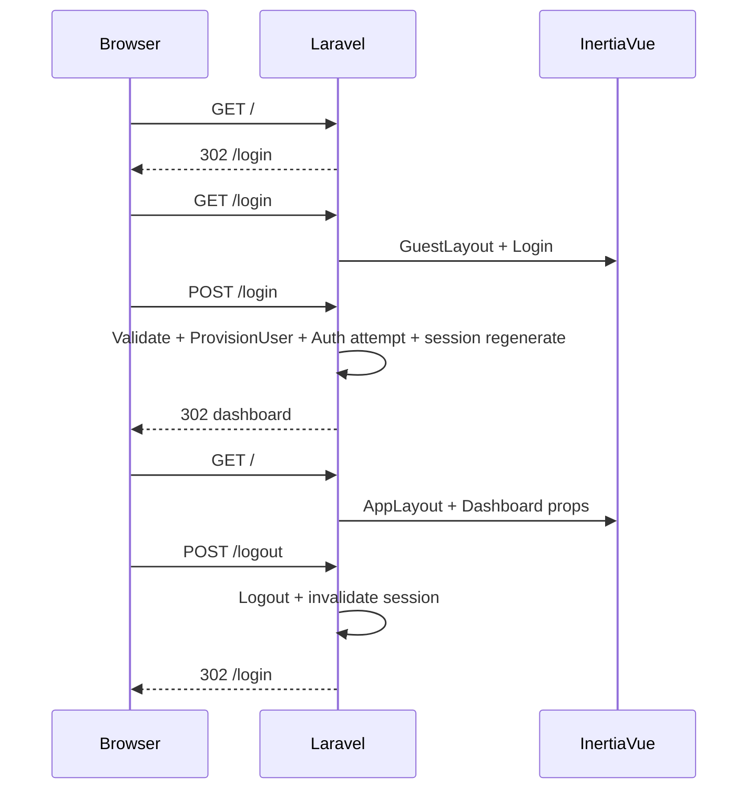

# Especificação: Fase 5 — Autenticação web, sessão e dashboard (Inertia + Vue 3)

Documento de especificação para implementar a **Fase 5** descrita em [tasks.md](tasks.md): proteção da área autenticada, login com **sessão web**, provisionamento idempotente de utilizador local, **isolamento de dados por utilizador**, **dashboard** servido via **Inertia.js** e **Vue 3**, **logout** seguro e **testes de feature** correspondentes.

**Complemento — cadastro inicial do cliente:** ver [new_user.spec.md](new_user.spec.md) (formulário *Criar conta*, rotas, ligações **Login ↔ Registo** e testes).

Código-alvo: backend em **[src/](../src/)**. Padrões de front-end: [paterns/front-end_vue3.md](paterns/front-end_vue3.md). API OAuth2 existente: [laravel_passport_oauth2.md](laravel_passport_oauth2.md).

---

## 1. Objetivo

- Garantir que visitantes **não autenticados** não acedem à home/dashboard privada, sendo **redirecionados** para o fluxo de login.
- Garantir que, após **login bem-sucedido**, existe **sessão web válida** (guard `web`, cookie de sessão Laravel), **não** substituível por token de API isolado para efeitos de navegação nas páginas Inertia.
- Garantir **um único registo** por identidade local acordada (sem duplicar utilizadores no `upsert`), com **campo de vínculo documentado**.
- Garantir que **consultas e comandos** de negócio expostos (contas bancárias e recursos associados) **filtram sempre** pelo utilizador autenticado.
- Entregar **dashboard** mínimo com layout coerente, navegação e **ação “Sair”** que invalida sessão.
- Expor **logout** via método **POST** (ou equivalente seguro), com **CSRF** onde aplicável.
- Cobrir o comportamento com **testes de feature** listados em [tasks.md](tasks.md).

---

## 2. Relação entre sessão web e Passport (API)

| Aspeto | Guard `web` (sessão) | Guard `api` (Passport) |
|--------|----------------------|-------------------------|
| Uso principal | Páginas Inertia, formulários web, cookie de sessão | `Authorization: Bearer`, clientes SPA/M2M |
| Esta fase | **Obrigatório** para login no browser e dashboard | Mantém-se; não substitui a necessidade de sessão para o stack Inertia descrito |
| Autorização OAuth (authorize) | O fluxo Passport de autorização **assume** utilizador autenticado na web para aprovar clientes | Emissão de tokens após consentimento |

**Decisão normativa para a Fase 5:** implementar **login web** com credenciais (email + palavra-passe) e **sessão**, alinhado ao modelo `User` existente e ao `password` na base de dados. O **Authorization Code + PKCE** continua a aplicar-se a clientes que precisam de **tokens** para `/api`; não é obrigatório, nesta fase, substituir o login web por um fluxo PKCE exclusivo para abrir sessão no dashboard.

---

## 3. Fora do escopo

- **Login social** (Google, GitHub, etc.) via Socialite — não faz parte desta especificação; o vínculo futuro pode estender o mesmo serviço de provisionamento com `provider` + `provider_sub` se o produto o exigir.
- **Substituir** Inertia por SPA Vue Router** para páginas servidas pelo Laravel — fora do padrão [front-end_vue3.md](paterns/front-end_vue3.md).
- **Regras de negócio completas** de depósitos e correção monetária — apenas **isolamento** e, se necessário para testes e dashboard, **leitura** mínima de dados já persistidos (ex. contas por `user_id`).

---

## 4. Requisitos funcionais

| ID | Descrição |
|----|-----------|
| **RF-01** | Visitante que acede a URL protegida (ex. `/` como dashboard) recebe **redirecionamento** para a rota de login (HTTP 302 ou equivalente). |
| **RF-02** | Utilizador com sessão válida acede ao dashboard e vê **conteúdo esperado** (identidade mínima e, se aplicável, dados escopados). |
| **RF-03** | **Login:** `POST` com credenciais válidas cria/atualiza sessão; **regeneração de sessão** após login bem-sucedido (mitigar fixation). |
| **RF-04** | **Provisionamento local:** após autenticação bem-sucedida, executar **upsert idempotente** do perfil mínimo (ex. `name`, `email`) sem criar segunda linha para o mesmo vínculo. |
| **RF-05** | **Vínculo documentado:** o identificador canónico para deduplicação nesta fase é **`users.email`** (único na base). Comentário PHPDoc no serviço de provisionamento ou no model `User` deve explicitar este contrato. |
| **RF-06** | **Isolamento:** qualquer leitura ou escrita de recurso de domínio “por utilizador” (ex. `bank_accounts`) deve usar **`user_id` do utilizador autenticado**; tentativas de aceder ao recurso de outro utilizador resultam em **404** ou **403** (política do projeto, mas deve ser consistente e testada). |
| **RF-07** | **Dashboard:** página Inertia autenticada com **layout** (ex. `AppLayout`), mensagem de boas-vindas ou resumo, e controlo **“Sair”** que executa logout. |
| **RF-08** | **Logout:** rota **`POST`** (nome estável, ex. `logout`) que termina sessão, invalida dados de sessão relevantes e redireciona para login ou página pública. |
| **RF-09** | **CSRF:** formulários web e pedidos Inertia que mutam estado respeitam proteção CSRF do Laravel. |

---

## 5. Requisitos não funcionais

| ID | Descrição |
|----|-----------|
| **RNF-01** | Compatibilidade: **PHP 8.3**, **Laravel 13**, **Vue 3**, **Inertia.js** oficial para Laravel, **Vite**, **Tailwind CSS v4** (conforme `package.json` do projeto). |
| **RNF-02** | Estrutura de pastas e convenções de SFC alinhadas a [front-end_vue3.md](paterns/front-end_vue3.md): `Pages/`, `Layouts/`, Composition API, `<script setup>`. |
| **RNF-03** | Não versionar segredos; `.env` apenas local. |
| **RNF-04** | Testes automatizados executáveis com `php artisan test` no ambiente do repositório. |

---

## 6. Rotas e responsabilidades (contrato sugerido)

Nomes de rota são exemplos; o importante é o **contrato HTTP** e os **middlewares**.

| Método | URI | Middleware | Comportamento |
|--------|-----|------------|---------------|
| `GET` | `/` | `auth` | Render Inertia — dashboard (utilizador autenticado). |
| `GET` | `/login` | `guest` | Página de login (Inertia). |
| `POST` | `/login` | `guest`, throttle opcional | Validar credenciais; provisionar perfil; `Auth::attempt`; regenerar sessão; redirect intended/dashboard. |
| `GET` | `/register` | `guest` | Página *Criar conta* (Inertia); link «Já tenho uma conta» → login. Ver [new_user.spec.md](new_user.spec.md). |
| `POST` | `/register` | `guest`, throttle | Validação, criação de `User`, login automático, regeneração de sessão, provisionamento; redirect dashboard — detalhes em [new_user.spec.md](new_user.spec.md). |
| `POST` | `/logout` | `auth` | Logout; invalidar sessão; redirect. |

- **Redirecionamento de guests:** configurado globalmente ou no middleware `Authenticate` para apontar para `route('login')`.
- **Rotas API** existentes (`/api/...`) mantêm `auth:api` e escopos Passport; testes de isolamento podem usar um endpoint REST que recebe ID de recurso ou listagem, desde que o contrato esteja claro nesta especificação.

---

## 7. Modelo de dados e isolamento

- Tabela **`users`:** `email` **único** — chave de vínculo para o provisionamento nesta fase.
- Tabela **`bank_accounts`:** contém `user_id` com FK para `users`; toda a leitura/escrita via aplicação deve filtrar por `user_id = auth()->id()` (sessão) ou pelo `user_id` do token (API), conforme o canal.

### 7.1 Persistência do domínio Banking

- Deve existir **implementação concreta** de [BankAccountRepositoryInterface](../src/app/Domain/Banking/Repositories/BankAccountRepositoryInterface.php) (ou camada equivalente aprovada pelo time) que **nunca** devolva entidade de outro utilizador em `findByIdForUser` / `findByIdForUpdate`.
- Modelo Eloquent **`BankAccount`** (ou nome alinhado ao projeto) mapeia a tabela existente; relação `User` ↔ `BankAccount` documentada.

---

## 8. Camada front-end (Inertia + Vue 3)

### 8.1 Stack

- **Laravel** — `Inertia::render()` nos controllers das rotas web autenticadas.
- **Inertia + Vue 3** — `createInertiaApp`, páginas em `resources/js/Pages/`, layouts em `resources/js/Layouts/`.
- **Tailwind v4** — classes utilitárias; entrada CSS existente do projeto.
- **Dados:** props vindas do servidor; estado global mínimo (ver doc de padrões).

### 8.2 Componentes obrigatórios de UX

- **Login:** formulário com campos acordados (email, password); erros por campo quando a validação falhar; uso de **`useForm`** do Inertia ou equivalente para `processing` e erros; **link para criar conta** (`register`), conforme [new_user.spec.md](new_user.spec.md).
- **Registo (cadastro do cliente):** página *Criar conta* com campos e fluxo definidos em [new_user.spec.md](new_user.spec.md), incluindo link **«Já tenho uma conta»** para o login.
- **Dashboard:** layout com identificação do utilizador e **botão Sair** implementado como **pedido POST** (form Inertia ou `router.post`), não como `GET` solto.

### 8.3 Partilha de dados com todas as páginas

- Middleware **`HandleInertiaRequests`**: partilhar pelo menos `auth.user` (dados necessários e seguros para o cliente — evitar expor segredos).

---

## 9. Segurança

1. **CSRF:** tokens em formulários e pedidos Inertia compatíveis com `VerifyCsrfToken`.
2. **Sessão:** `session()->regenerate()` após login.
3. **Logout:** invalidação de sessão no servidor (`Auth::logout()`, `session()->invalidate()` conforme práticas Laravel).
4. **Throttle:** recomendado em `POST /login` para mitigar brute force (configuração Laravel padrão ou rate limit explícito).

---

## 10. Testes (obrigatórios)

Conforme [tasks.md](tasks.md):

| # | Caso |
|---|------|
| 1 | Visitante **não** acede ao dashboard (ou `/` protegido) — redireciona para login. |
| 2 | Utilizador autenticado (sessão) acede ao dashboard e vê conteúdo esperado. |
| 3 | Após logout, o mesmo cliente **não** acede ao dashboard sem novo login. |
| 4 | Utilizador A **não** lista nem altera dados de B — **pelo menos um caso** por recurso crítico acordado (ex. conta bancária por ID). |
| 5 | *(Opcional)* Primeiro login cria utilizador local onde aplicável; segundo login com o mesmo vínculo **não duplica** linhas em `users`. |

---

## 11. Diagrama de sequência (sessão web)

---

## 12. Critérios de aceitação (checklist)

- [ ] Rotas privadas protegidas por `auth` e guests por `guest` onde aplicável.
- [ ] Login cria sessão web; dashboard só com sessão.
- [ ] Serviço de provisionamento com **upsert** por **`email`** documentado.
- [ ] Dados de contas (e similares) **filtrados por utilizador**; teste de negação A/B.
- [ ] Logout **POST** + CSRF; “Sair” no UI dispara esse fluxo.
- [ ] Páginas Vue em `Pages/`, layouts em `Layouts/`, `<script setup>`, Tailwind, sem misturar axios e Inertia para a mesma mutação sem organização.
- [ ] Testes de feature a verde para os casos obrigatórios.

---

## 13. Referências internas

- [tasks.md](tasks.md) — Fase 5
- [new_user.spec.md](new_user.spec.md) — cadastro inicial (cliente), fluxo e ligações Login ↔ Registo
- [paterns/front-end_vue3.md](paterns/front-end_vue3.md) — padrões Vue 3 + Inertia
- [laravel_passport_oauth2.md](laravel_passport_oauth2.md) — OAuth2 / API

---

*Documento normativo para implementação; atualizar caminhos exatos (`resources/js` vs convenções do repo) se o projeto usar prefixos diferentes, mantendo os RF/RNF.*
