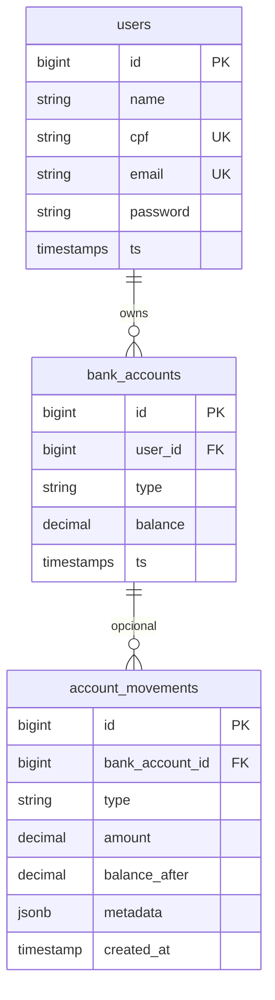
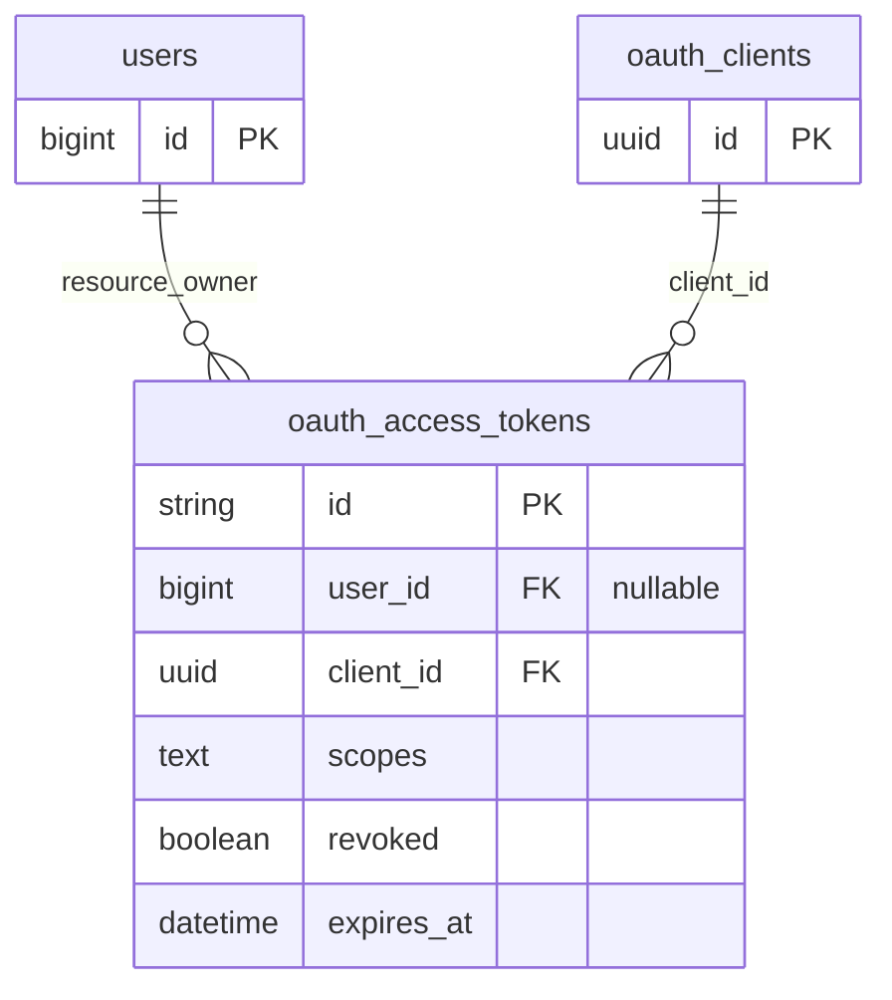

# Especificação — tabelas (modelo de dados)

Definição do **esquema relacional** para o backend Laravel + **PostgreSQL** (ver [README.md](../README.md) e [infra.md](infra.md)), alinhado ao domínio descrito em [domains.spac.md](domains.spac.md) e às regras de [php-laravel.patern.md](paterns/php-laravel.patern.md). **Models Eloquent** são infraestrutura; este documento descreve o **banco**.

---

## 1. Convenções

| Tema | Decisão |
|------|---------|
| SGBD | PostgreSQL |
| Nomes de tabela | `snake_case`, plural onde fizer sentido (`users`, `bank_accounts`) |
| PK | `bigserial` / `bigint` auto-increment (`id`) salvo indicação contrária |
| FK | `user_id`, `bank_account_id`, … com índice; `ON DELETE` explícito por tabela |
| Moeda | Uma moeda (BRL) no MVP; colunas `decimal(15, 2)` para valores monetários **no banco**; regra de arredondamento na aplicação/domínio |
| Timestamps | `created_at`, `updated_at` (`timestamps()`) nas tabelas de negócio |
| Unicidade | Únicos parciais só se necessário; caso padrão: `UNIQUE` em coluna |

---

## 2. Tabelas existentes / framework (Laravel)

As migrations padrão do Laravel já contemplam:

| Tabela | Observação |
|--------|------------|
| `users` | Deve ser **estendida** para o requisito de negócio (CPF); ver seção 3. |
| `password_reset_tokens` | Manter conforme framework |
| `sessions` | Manter conforme framework |
| `cache`, `jobs` (e filas) | Conforme migrations do projeto |

### Passport (OAuth2) — infraestrutura

Tabelas introduzidas pelas migrações do **Laravel Passport** (publicação + `php artisan migrate`, fluxo tipo `passport:install` conforme a versão). **Não** copiar coluna a coluna neste documento: manter como referência única as migrações do projeto e a [especificação OAuth2 / Passport](laravel_passport_oauth2.md) (fluxos, escopos, configuração).

Tratar como **infraestrutura de autenticação/autorização**, não como modelo de negócio; o diagrama ER da secção 6 permanece só para agregados de produto.

| Tabela | Propósito (resumo) |
|--------|--------------------|
| `oauth_auth_codes` | Códigos de autorização trocados no fluxo Authorization Code (incl. PKCE). |
| `oauth_access_tokens` | Access tokens emitidos; metadados como escopos, revogação e expiração. |
| `oauth_refresh_tokens` | Refresh tokens associados a access tokens quando o fluxo os utiliza. |
| `oauth_clients` | Registo de clientes OAuth (públicos ou confidenciais). |
| `oauth_device_codes` | Device authorization flow (quando aplicável ao Passport instalado). |

**Ligação ao cadastro:** em fluxos centrados no utilizador (ex.: Authorization Code), `oauth_access_tokens.user_id` identifica o **resource owner** no mesmo universo que `users.id`. Em fluxos só cliente (ex.: client credentials), `user_id` pode ser nulo — alinhado às migrações Passport do projeto.

---

## 3. `users` (cadastro — requisitos do README)

Além dos campos habituais do Laravel, o produto exige:

| Coluna | Tipo | Restrições |
|--------|------|------------|
| `id` | bigint PK | auto |
| `name` | varchar(255) | NOT NULL |
| `cpf` | varchar(14) ou char(11) | NOT NULL, **UNIQUE** — armazenar normalizado (apenas dígitos) se possível |
| `email` | varchar(255) | NOT NULL, **UNIQUE** |
| `email_verified_at` | timestamp | nullable |
| `password` | varchar(255) | NOT NULL (hash) |
| `remember_token` | varchar(100) | nullable |
| `created_at`, `updated_at` | timestamp | |

**Índices sugeridos:** `UNIQUE (cpf)`, `UNIQUE (email)` já cobrem buscas por credencial.

**OAuth2 (Passport):** access tokens e restantes artefactos OAuth residem nas tabelas `oauth_*`; **não** se espera coluna de API token na própria `users` (evitar o padrão legacy `api_token` na tabela de utilizador).

**Migração:** pode ser `Schema::table('users', ...)` em nova migration se `users` já existir sem `cpf`.

---

## 4. `bank_accounts`

Contas do usuário: uma linha por conta, **tipo discriminador** + saldo atual.

| Coluna | Tipo | Restrições |
|--------|------|------------|
| `id` | bigint PK | auto |
| `user_id` | bigint FK → `users.id` | NOT NULL, index; `ON DELETE CASCADE` (ou `RESTRICT` se o produto proibir apagar usuário com contas — alinhar ao caso de uso) |
| `type` | varchar(32) ou enum PG | NOT NULL — valores: `savings`, `checking`, `investments` (ou nomes em inglês padronizados no código; mapear a Poupança/Corrente/Investimentos) |
| `balance` | decimal(15,2) | NOT NULL, default `0`, CHECK `balance >= 0` se o negócio não permitir saldo negativo |
| `created_at`, `updated_at` | timestamp | |

**Índices sugeridos:**

- `(user_id)` — listar contas do usuário
- Opcional: `UNIQUE (user_id, type)` se o negócio permitir **no máximo uma conta de cada tipo por usuário** (o README sugere três tipos por usuário; confirmar como regra — se sim, unique composto é adequado)

---

## 5. Tabela opcional — histórico de movimentos

Não é obrigatória para cumprir o README (saldo e operações podem atualizar só `balance`), mas **recomendada** para auditoria e suporte:

### `account_movements` (opcional)

| Coluna | Tipo | Restrições |
|--------|------|------------|
| `id` | bigint PK | |
| `bank_account_id` | bigint FK | NOT NULL → `bank_accounts.id`, index |
| `type` | varchar(32) | ex.: `deposit`, `monthly_adjustment` |
| `amount` | decimal(15,2) | valor assinado ou sempre positivo + coluna `direction`; definir convenção única no código |
| `balance_after` | decimal(15,2) | nullable ou NOT NULL conforme implementação |
| `metadata` | jsonb | nullable (detalhes extras) |
| `created_at` | timestamp | |

Se esta tabela existir, o **caso de uso** na Application deve persistir movimento e atualizar saldo na **mesma transação**.

---

## 6. Diagrama lógico (MVP)

### 6.1 Diagrama opcional — infra OAuth2 (Passport)

Referência apenas para visão DBA; **não** confundir com agregados de negócio da secção 6.

---

## 7. Regras de negócio vs colunas

As regras de **depósito** (incremento de R$ 0,50 em corrente/investimentos) e **correção monetária** (percentuais por tipo) **não** são colunas fixas na tabela; são implementadas na **camada de domínio/aplicação**. O banco armazena **estado** (`type`, `balance`) e metadados necessários.

---

## 8. Checklist de revisão (schema)

- [ ] `users.cpf` único e consistente com validação de domínio/API?
- [ ] `bank_accounts.type` com conjunto fechado alinhado ao enum/código?
- [ ] FKs e `ON DELETE` coerentes com política de exclusão?
- [ ] Precision de `decimal` suficiente para saldos e somatórios esperados no teste?
- [ ] Índices para consultas reais (por `user_id`, por `id` junto de `user_id` na API)?
- [ ] Migrações Passport aplicadas e consistentes com a versão fixada em `composer.lock`?
- [ ] Revogação e ciclo de vida de tokens alinhados ao comportamento do Passport (sem duplicar regras de negócio neste documento)?

---

*Documento vivo: ajustar nomes de enums (`type`) e opcionalidade de `account_movements` conforme decisão de produto.*
